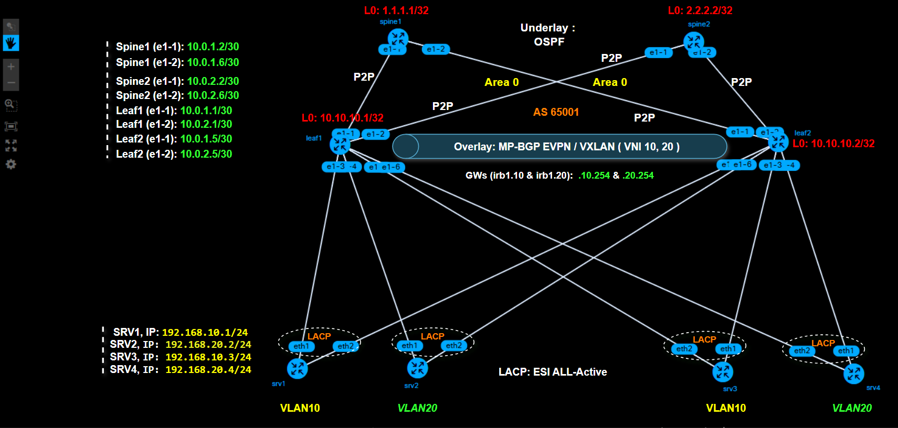

# EVPN-VXLAN-Datacenter-Nokia-SRL
# 🌐 Enterprise Datacenter Fabric: EVPN-VXLAN with All-Active Multihoming (Nokia SR Linux)

## 📌 1. Project Overview
This project demonstrates the design, deployment, and verification of a highly available Datacenter Fabric using **Nokia SR Linux (SRL v25)**. 

The architecture is built on a robust **OSPFv2 underlay** and an **iBGP EVPN/VXLAN overlay**. It provides seamless Layer 2 and Layer 3 virtualization, utilizing **Asymmetric IRB** for routing. A key feature of this deployment is the implementation of **EVPN All-Active Multihoming (ESI)**, which ensures 100% link utilization and achieves sub-second failover (0% packet loss) during link failures, effectively replacing legacy protocols like STP.

## ☁️ 2. Lab Environment & Prerequisites
This deployment was tested on a cloud-based environment to handle multiple Nokia SRL instances smoothly.

* **Cloud Provider:** Microsoft Azure
* **Virtual Machine:** Ubuntu Linux (Size: Standard D2s v3 - 2 vCPUs, 8 GiB Memory)
* **Container Runtime:** Docker (Version 27.5.1)
* **Orchestration Tool:** Containerlab (Version 0.64.0)
* **Network OS (NOS):** Nokia SR Linux (`ghcr.io/nokia/srlinux`)

## 🏗️ 3. Network Architecture & Topology
The setup uses a standard 2-Spine / 2-Leaf architecture.



### 📊 IP & BGP Allocation Matrix
All nodes operate within the same Autonomous System (**AS 65001**) to form an iBGP EVPN Overlay.

| Node        | Role                         | System IP (Underlay)      | BGP ASN |
| :---        | :--------------------------- | :-----------------------  | :-------|
| **spine1**  | Spine / iBGP Route Reflector | `1.1.1.1/32`              | `65001` |
| **spine2**  | Spine / iBGP Route Reflector | `2.2.2.2/32`              | `65001` |
| **leaf1**   | Leaf / VTEP                  | `10.10.10.1/32`           | `65001` |
| **leaf2**   | Leaf / VTEP                  | `10.10.10.2/32`           | `65001` |

## 🛠️ 4. Underlay Network (OSPF)
**OSPFv2 (Area 0)** is configured as the Interior Gateway Protocol (IGP). It runs across all physical links and system interfaces, ensuring loop-free reachability between all `System IPs` (`1.1.1.1`, `2.2.2.2`, `10.10.10.1`, `10.10.10.2`). This is essential for establishing BGP peerings and VXLAN tunnels.

## 🌐 5. Overlay Network (iBGP EVPN)
The control plane is driven by **MP-iBGP** with the EVPN address family:
* `spine1` and `spine2` act as **Route Reflectors**, eliminating the need for a full BGP mesh between the leafs.
* The EVPN control plane handles endpoint discovery natively using **EVPN Type 2 (MAC/IP)** routes.

## 🏢 6. Dataplane & Tenancy (VXLAN & Asymmetric IRB)
Data forwarding over the IP core is encapsulated in **VXLAN** tunnels.
* **L2 Virtualization (MAC-VRF):** Segmented into `vlan10` and `vlan20`.
* **L3 Routing (IP-VRF & Asymmetric IRB):** We implemented Asymmetric IRB using `ip-vrf-1`. Routing occurs at the ingress leaf, and traffic is bridged across the VXLAN tunnel to the egress leaf.
* **Anycast Gateway:** Hosts share the same Default Gateway IP configured on the `irb1` subinterfaces (`192.168.10.254` for VLAN 10 and `192.168.20.254` for VLAN 20).

## 🔗 7. All-Active Multihoming (EVPN ESI)
Servers are connected to both leafs using **LACP (802.3ad) port-channels**. 
By configuring an Ethernet Segment Identifier (ESI, `00:00:00:00:00:11`) and `bgp-instance 1`, both `leaf1` and `leaf2` operate in an **Active-Active** state for the same server. This allows load balancing and eliminates single points of failure.

## ✅ 8. Verification & Failover Testing
### Sub-second Failover (0% Packet Loss)
A continuous ping was initiated between end hosts. When one of the physical uplinks inside the LACP Bond was administratively disabled (`ip link set eth1 down`), the traffic instantly shifted to the remaining active link with **0% packet loss**.


### Control Plane Verification
BGP sessions, EVPN routes, and ARP synchronization (via EVPN Type 2 routes) were successfully verified on the Nokia SRL CLI.


## 🚀 9. How to Run This Lab

### Step 1: Clone the Repository
```bash
git clone [https://github.com/YOUR_USERNAME/Nokia-SRL-EVPN-Datacenter.git](https://github.com/YOUR_USERNAME/Nokia-SRL-EVPN-Datacenter.git)
cd Nokia-SRL-EVPN-Datacenter
