# 🧪 Verification & Testing Guide

This document outlines the step-by-step verification process to ensure the **Nokia SR Linux EVPN-VXLAN Datacenter Fabric** is operating correctly. The testing methodology follows a top-down approach: verifying the Core (Underlay/Overlay), the Edge (Encapsulation/VRFs), and finally the Application Layer (Dataplane/Failover).

---

## 🟢 Phase 1: Core Layer & Underlay Verification
We begin by verifying the robust foundation of the fabric: the OSPF underlay and the iBGP control plane.

### 1. OSPF Adjacencies (Spines)
Verifying that both spines have established full OSPF adjacencies with the connected leaf nodes in Area 0.
```bash
# On spine1
show network-instance default protocols ospf neighbor

# On spine2
show network-instance default protocols ospf neighbor
```
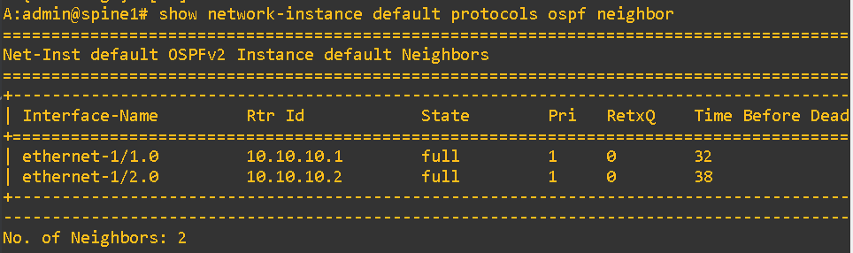
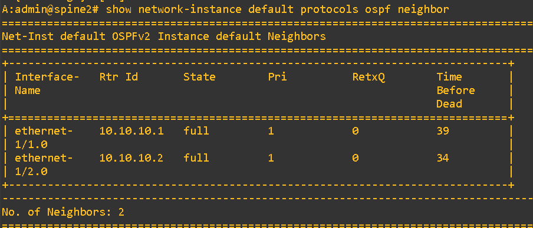

Both spines show a `FULL` OSPF state with `leaf1` (10.10.10.1) and `leaf2` (10.10.10.2). This confirms the underlay routing topology is converged.

### 2. Underlay End-to-End Reachability (Leafs)
Testing the underlay IP reachability from the edge nodes to the core (Spines) and remote edge (Leafs).
```bash
# On leaf1: Ping spine1 and leaf2 system IPs
ping 1.1.1.1 network-instance default -c 2
ping 10.10.10.2 network-instance default -c 2

# On leaf2: Ping spine2 and leaf1 system IPs
ping 2.2.2.2 network-instance default -c 2
ping 10.10.10.1 network-instance default -c 2
```
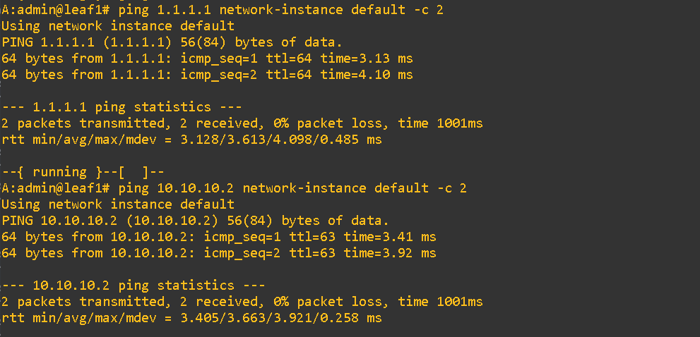
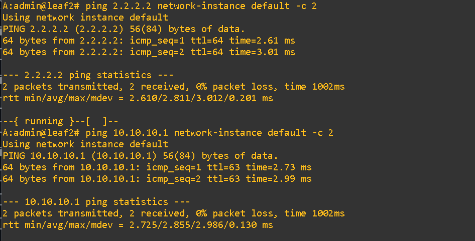

ICMP Echo replies are successful across the `default` network-instance. This proves the physical links and OSPF routing are successfully delivering traffic between all VTEP System IPs.

### 3. iBGP EVPN Sessions (Route Reflectors)
Confirming the MP-BGP EVPN sessions between the Route Reflectors and the VTEPs.
```bash
# On spine1
show network-instance default protocols bgp summary

# On spine2
show network-instance default protocols bgp summary
```

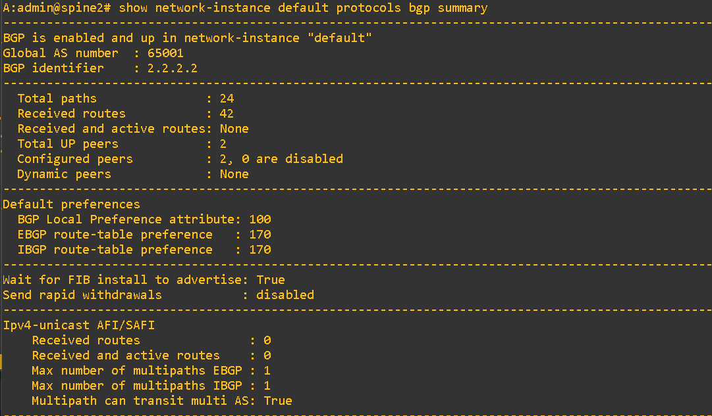

The BGP sessions for the EVPN address family are successfully `established`. Both spines (AS 65001) are peering with the leaf nodes, ensuring control plane redundancy.

---

## 🔵 Phase 2: Edge Layer & Overlay Verification (Leafs)
Next, we validate the encapsulation, tenancy, routing tables, and multihoming configurations on the VTEPs.

### 4. VXLAN Dataplane & Tunnel Status
Verifying the operational state of the VXLAN interfaces and the configured Virtual Network Identifiers (VNIs).
```bash
# On leaf1
show tunnel-interface vxlan1

# On leaf2
show tunnel-interface vxlan1
```
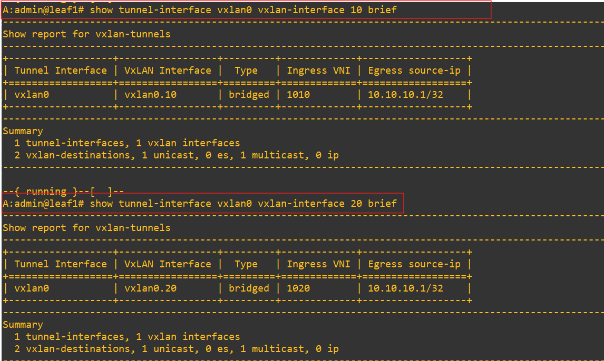
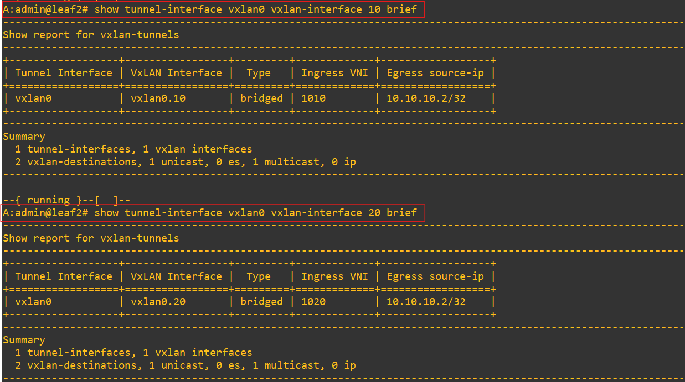

Both leaf nodes show the `vxlan1` tunnel interface in an operational `up` state, confirming the proper instantiation of Layer 2 (VNI 10, 20) and Layer 3 (VNI 1000) segments.

### 5. L2 MAC-VRF Learning (EVPN Type 2)
Verifying that EVPN MAC/IP routes are correctly advertised and installed in the local MAC tables.
```bash
# On leaf1
show network-instance vlan10 bridge-table mac-table

# On leaf2
show network-instance vlan10 bridge-table mac-table
```
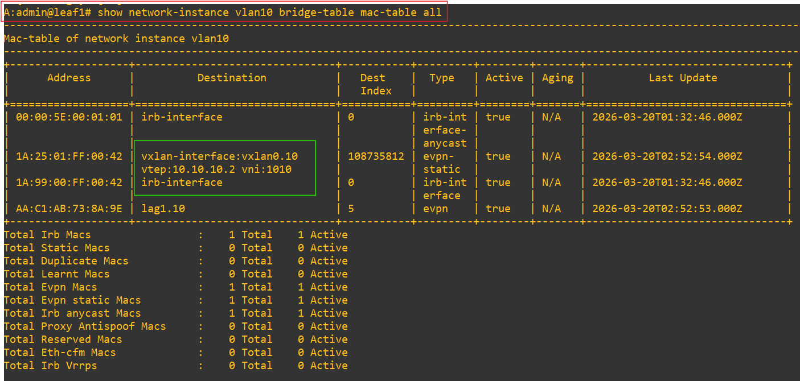
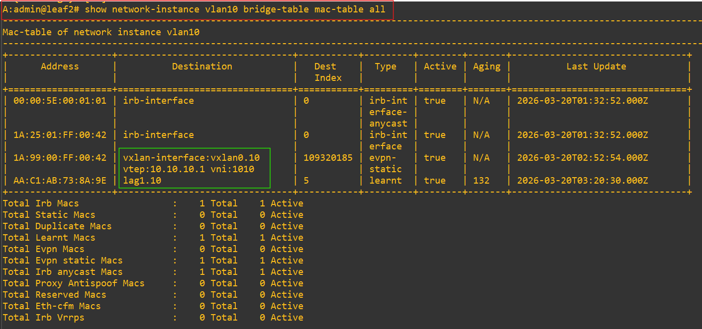

Both leafs dynamically learned the remote endpoints via EVPN `vxlan1` interfaces and local endpoints via the multihomed `lag1`, effectively synchronizing the L2 broadcast domains.

### 6. L3 IP-VRF Routing (Asymmetric IRB)
Validating the L3 routing tables for the tenant VRF to ensure Inter-VLAN routing is possible.
```bash
# On leaf1
show network-instance ip-vrf-1 route-table ipv4

# On leaf2
show network-instance ip-vrf-1 route-table ipv4
```
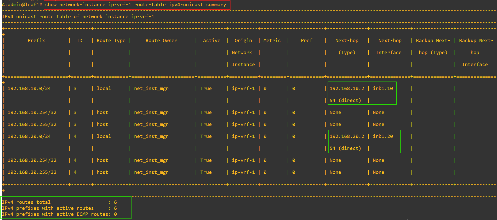
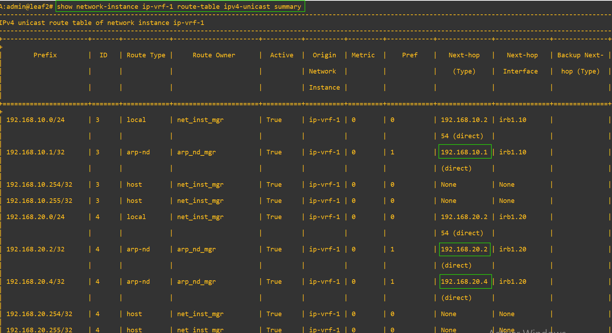

The `ip-vrf-1` routing table displays the active routes for all subnets (e.g., `192.168.10.0/24` and `192.168.20.0/24`), confirming that the Asymmetric IRB logic is fully populated via local subinterfaces and BGP EVPN.

### 7. Distributed Anycast Gateway (ARP Synchronization)
Validating the IP-to-MAC resolution on the IRB interfaces.
```bash
# On leaf1
show arpnd arp-entries

# On leaf2
show arpnd arp-entries
```
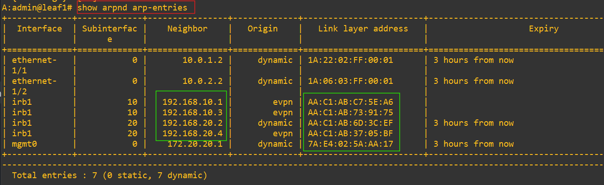
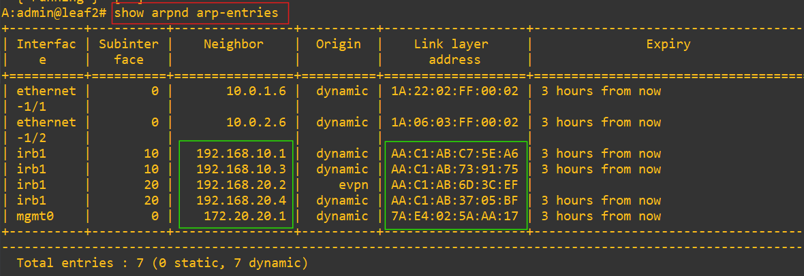

Both leafs successfully resolve the ARP entries for hosts via the `irb1` subinterfaces, proving that the Layer 3 distributed gateways are active and synchronized.

### 8. All-Active Multihoming (ESI & LACP)
Checking the status of the Ethernet Segment Identifiers (ESI) and the aggregated links toward the dual-homed servers.
```bash
# On leaf1
show interface lag1 detail
show system network-instance protocols evpn ethernet-segments

# On leaf2
show interface lag1 detail
show system network-instance protocols evpn ethernet-segments
```
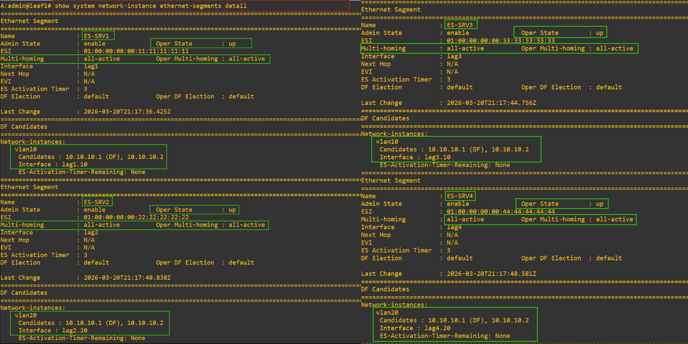
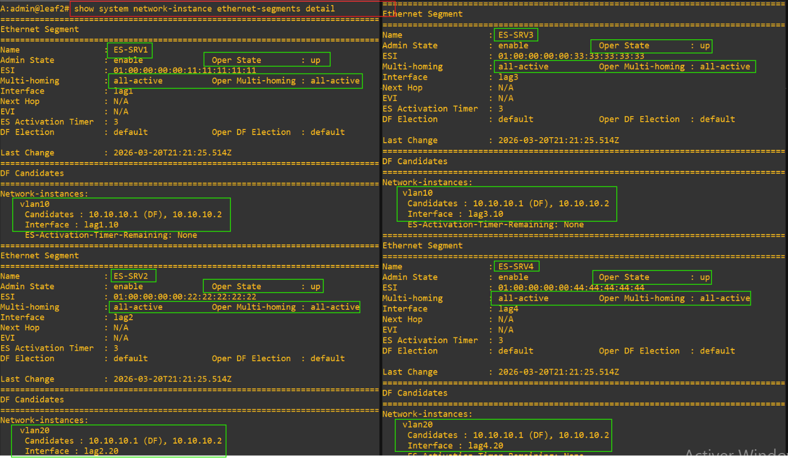

The ESI `00:00:00:00:00:11` is operational in `all-active` mode. The LACP port-channels (`lag1`) are in a forwarding state (`distributing`), ensuring active-active load balancing without STP.

---

## 🔴 Phase 3: Application Layer & Failover (Servers)
The final validation focuses on end-to-end dataplane reachability and High Availability.

### 9. Intra-VLAN & Inter-VLAN Reachability
Testing L2 bridging (same subnet) and L3 routing (different subnets).
```bash
# Intra-VLAN: srv1 (VLAN 10) to srv3 (VLAN 10)
docker exec -it clab-pro-evpn-srv1 ping -c 4 192.168.10.3

# Inter-VLAN: srv1 (VLAN 10) to srv4 (VLAN 20)
docker exec -it clab-pro-evpn-srv1 ping -c 4 192.168.20.4
```
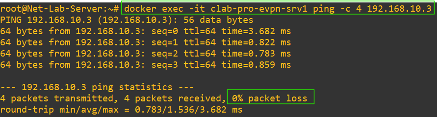
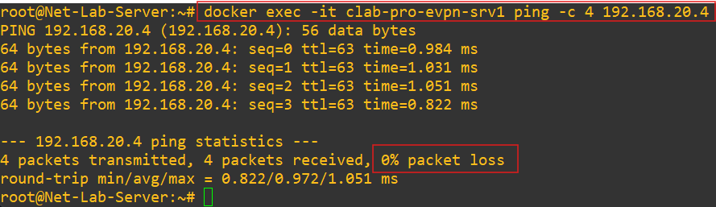

End hosts communicate seamlessly across the fabric. Intra-VLAN traffic is bridged across the VXLAN tunnel, while Inter-VLAN traffic is successfully routed at the ingress leaf using `ip-vrf-1`.

### 10. Sub-second Failover Test (0% Packet Loss)
Simulating a physical link failure on a dual-homed server to validate the ESI failover mechanism.
```bash
# Terminal 1: Initiate continuous ping from srv1 to srv4
docker exec -it clab-pro-evpn-srv1 ping 192.168.20.4

# Terminal 2: Administratively down one uplink on srv1
docker exec -it clab-pro-evpn-srv1 ip link set eth1 down
```
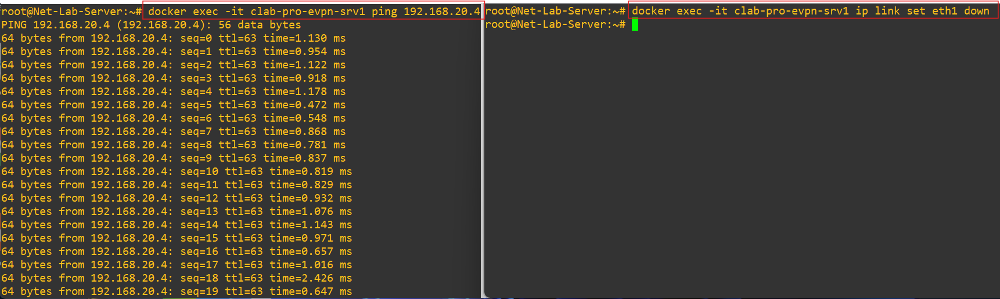


Despite the deliberate link failure (`eth1`), the continuous ping shows **0% packet loss**. The EVPN multihoming control plane instantly redirected the traffic flow to the remaining active link (`eth2`), demonstrating true carrier-grade High Availability.
